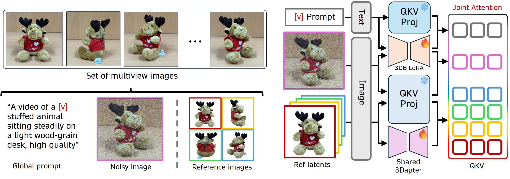

<div align="center">
<h1>3DreamBooth</h1>
<h4>High-Fidelity 3D Subject-Driven Video Generation</h4>
<a href="https://ko-lani.github.io">Hyun-kyu Ko</a><sup>1,*</sup>  · 
<a href="https://github.com/Kanadae">Jihyeon Park</a><sup>2,*</sup>  · 
<a href="https://github.com/yhyun225">Younghyun Kim</a><sup>1</sup>  · 
<a href="https://github.com/DHPark98">Dongheok Park</a><sup>2</sup>  · 
<a href="https://silverbottlep.github.io">Eunbyung Park</a><sup>1,†</sup>
<br/><br/>
<sup>1</sup> Yonsei University    <sup>2</sup> Sungkyunkwan University
<br/>
<sub>* Equal contribution    † Corresponding author</sub>
<br/><br/>
<br/>

<a href="https://arxiv.org/abs/2603.18524"></a>
<a href="https://ko-lani.github.io/3DreamBooth"></a>
<a href="https://huggingface.co/lanikoisgod/3Dapter"></a>
<a href="https://huggingface.co/datasets/lanikoworld/3D-CustomBench"></a>


https://github.com/user-attachments/assets/f968f978-01ab-4e78-98be-cbe212d44d1a


</div>

---

## Overview

**3DreamBooth** is a novel framework for high-fidelity 3D subject-driven video generation. Given a set of multi-view reference images of a subject, our method generates identity-preserving, view-consistent videos with rich 3D spatial awareness.

Our framework comprises two components:

- **3Dapter** — a visual conditioning module that enhances fine-grained texture preservation and accelerates convergence via multi-view joint attention with shared weights.
- **3DreamBooth** — a DreamBooth-style test-time optimization that decouples spatial geometry from temporal motion through a 1-frame optimization paradigm, baking a robust 3D prior without exhaustive video-based training.



---

## Results

3DreamBooth generates cinematic, identity-preserving videos across diverse subjects and creative scenarios — bags, plushies, sculptures, motorcycles, watches, and more.

> 📽️ See our [project page](https://ko-lani.github.io/3DreamBooth) for full video results.

---

## Code Release

The public release currently includes:

- ✅ Inference code
- ✅ 3Dapter pretrained weights
- ✅ 3D-CustomBench benchmark
- ✅ Training code
- ⬜ Evaluation code

**Star ⭐ this repo to get notified when the evaluation code drops.**

---

## Training and inference

| Mode | Train | Validate | What it learns |
|---|---|---|---|
| **3DreamBooth** | `train_3dreambooth.py` | `validate_3dreambooth.py` | Subject-specific spatial LoRA |
| **3Dapter** | `train_3dapter.py` | `validate_3dapter.py` | Reference-conditioned adapter |
| **Joint** | `train_joint.py` | `validate_joint.py` | Subject LoRA + 3Dapter together |

All three modes use the same YAML-driven interface:

```bash
python scripts/run.py <config.yaml>
```

The runner resolves config inheritance, applies command-line overrides, launches `torch.distributed.run`, and prints the exact command for reproducibility.

## Installation

```bash
git clone https://github.com/Ko-Lani/3DreamBooth.git
cd 3DreamBooth

conda create -n 3dreambooth python=3.10 -y
conda activate 3dreambooth
pip install -r requirements.txt
```

Python 3.10 and a recent CUDA-capable PyTorch environment are recommended. Model and adapter weights are intentionally not included in this repository.

## Checkpoint setup

Install the Hugging Face and ModelScope CLIs:

```bash
pip install -U "huggingface_hub[cli]" modelscope
```

Download HunyuanVideo-1.5 into the path used by the public configs:

```bash
hf download tencent/HunyuanVideo-1.5 \
  --local-dir ./checkpoints/hunyuanvideo-1.5 \
  --include "transformer/480p_t2v*" "transformer/720p_t2v*" \
  "text_encoder/**" "tokenizer/**" "vae/**" "*.json" "*.txt" "*.md"

hf download Qwen/Qwen2.5-VL-7B-Instruct \
  --local-dir ./checkpoints/hunyuanvideo-1.5/text_encoder/llm
hf download google/byt5-small \
  --local-dir ./checkpoints/hunyuanvideo-1.5/text_encoder/byt5-small
modelscope download --model AI-ModelScope/Glyph-SDXL-v2 \
  --local_dir ./checkpoints/hunyuanvideo-1.5/text_encoder/Glyph-SDXL-v2
```

The vision encoder requires access to FLUX.1-Redux-dev:

```bash
hf download black-forest-labs/FLUX.1-Redux-dev \
  --local-dir ./checkpoints/hunyuanvideo-1.5/vision_encoder/siglip \
  --token YOUR_HF_TOKEN
```

Download the pretrained 3Dapter used by Joint training:

```bash
hf download lanikoisgod/3Dapter --local-dir ./checkpoints/3dapter
```

Expected local layout:

```text
checkpoints/
├── hunyuanvideo-1.5/
│   ├── transformer/
│   ├── text_encoder/
│   ├── tokenizer/
│   ├── vae/
│   └── vision_encoder/
└── 3dapter/
    └── pytorch_lora_weights.safetensors
```

## Quick start: 3D-CustomBench graduation bear

### 1. Download 3D-CustomBench

```bash
python scripts/data/download_custombench.py
```

This downloads [`lanikoworld/3D-CustomBench`](https://huggingface.co/datasets/lanikoworld/3D-CustomBench) to `datasets/3d-custombench`. The example expects:

```text
datasets/3d-custombench/subjects/graduation_bear/
├── images/
├── references/
├── metadata.json
└── prompt.txt
```

Use a different dataset fork or revision when needed:

```bash
python scripts/data/download_custombench.py \
  --repo-id YOUR_ORG/3D-CustomBench \
  --revision main
```

### 2. Inspect the resolved commands

Dry-run mode loads and validates the YAML interface without loading model weights:

```bash
python scripts/run.py configs/examples/graduation_bear/train_3dreambooth.yaml --dry-run
python scripts/run.py configs/examples/graduation_bear/train_joint.yaml --dry-run
```

### 3. Train

Train the 3DreamBooth baseline:

```bash
python scripts/run.py configs/examples/graduation_bear/train_3dreambooth.yaml
```

Train the full Joint model:

```bash
python scripts/run.py configs/examples/graduation_bear/train_joint.yaml
```

The canonical prompt is `A video of a [v] [class].`; the graduation-bear example uses `A video of a [rhs plushie].`. Write the LoRA phrase inside square brackets—there is no need to configure span arguments separately.

<details>
<summary><b>How do bracketed LoRA spans work?</b></summary>

Square brackets are config-only markup. They are always removed before the prompt reaches the tokenizer.

**1. Training**

```yaml
train_prompts:
  - A video of a [rhs plushie].
```

The runner sends the clean prompt below and applies LoRA to the **full training prompt**:

```text
A video of a rhs plushie.
```

**2. Validation during training**

```yaml
validation_prompts:
  - A video of a [rhs plushie] on a beach.
```

The runner removes the brackets and automatically creates the legacy argument:

```bash
--validation_prompts "A video of a rhs plushie on a beach." \
--validation_lora_spans "rhs plushie"
```

**3. Validation/inference after training**

```yaml
prompt: A video of a [rhs plushie] on a beach.
```

The runner converts it to:

```bash
--prompt "A video of a rhs plushie on a beach." \
--text_lora_spans "rhs plushie"
```

The model receives the clean sentence, but text LoRA is applied only to the `rhs plushie` tokens. The surrounding scene description does not receive text LoRA. Unbalanced brackets and validation prompts without a marked span are rejected before model loading.

See [Prompt and LoRA span format](docs/prompt-format.md) for multiple-span examples.

</details>

### 4. Validate

After training reaches `checkpoint-400`:

```bash
python scripts/run.py configs/examples/graduation_bear/validate_3dreambooth.yaml
python scripts/run.py configs/examples/graduation_bear/validate_joint.yaml
```

Validate the pretrained 3Dapter independently:

```bash
python scripts/run.py configs/examples/graduation_bear/validate_3dapter.yaml
```

Generated videos are written below `validation_outputs/` and ignored by Git.

## Configuration

Base configs live in:

```text
configs/
├── train/
│   ├── 3dreambooth.yaml
│   ├── 3dapter.yaml
│   └── joint.yaml
├── validate/
│   ├── 3dreambooth.yaml
│   ├── 3dapter.yaml
│   └── joint.yaml
└── examples/graduation_bear/
```

Each file has the same shape:

```yaml
name: my_experiment
stage: train                 # train | validate
method: joint                # 3dreambooth | 3dapter | joint

environment:
  CUDA_VISIBLE_DEVICES: "0"

runtime:
  nproc_per_node: 1
  master_port: 8003

args:                        # forwarded to the selected Python entrypoint
  train_prompts:
    - A video of a [rhs plushie].
  max_steps: 400
  batch_size: 1
```

Override any value without editing the file:

```bash
python scripts/run.py configs/train/joint.yaml \
  --set args.instance_data_root=./data/my_subject/images \
  --set args.reference_path=./data/my_subject/references \
  --set args.output_dir=./outputs/joint/my_subject \
  --set args.max_steps=800
```

For multi-GPU sequence parallelism, set both process count and sequence-parallel size:

```bash
python scripts/run.py configs/train/joint.yaml \
  --set runtime.nproc_per_node=4 \
  --set args.sp_size=4
```

See [Training and validation modes](docs/training-modes.md) for method-specific inputs.

## Prepare your own subject

Use the same layout as a 3D-CustomBench subject:

```text
data/my_subject/
├── images/
│   ├── 001.jpeg
│   └── ...
└── references/
    ├── 001.png
    └── ...
```

`images/` contains the ordered multi-view captures. `references/` contains a small subset with the background removed, composited on white, and normalized to a square crop for 3Dapter conditioning. The current preprocessing implementation is in `remove_bg.py`; set its input/output paths for your subject before running it.

DreamBooth prompts use a rare identifier followed by a class word inside square brackets:

```text
A video of a [rhs plushie].
```

Square brackets are config-only markup:

- Training removes the brackets and applies LoRA to the full prompt.
- Validation during training generates `validation_lora_spans` from the marked phrase.
- Validation/inference after training generates `text_lora_spans` from the marked phrase.

The class word (`plushie`) describes the category; the rare identifier (`rhs`) carries its learned identity. Keep the marked phrase consistent across training and validation.

## 3D-CustomBench release

3D-CustomBench is published separately so the source repository remains lightweight. The release tool converts the legacy `full/`, `cond/`, and `prompts/` trees into stable semantic subject IDs and numbered files:

```bash
python scripts/data/prepare_custombench.py \
  /path/to/legacy/custombench \
  /path/to/3D-CustomBench-release
```

It creates `manifest.json` and per-subject metadata while retaining each old folder name as `legacy_id`. Follow [the 3D-CustomBench release guide](docs/custombench.md) to review, license, and upload the dataset to Hugging Face.

The prepared release can be checked without uploading:

```bash
python scripts/data/upload_custombench.py --repo-id lanikoworld/3D-CustomBench
```

After selecting a license and running `hf auth login`, add `--upload`. The helper creates a private dataset by default; publication requires the explicit `--public` option.

## Repository layout

```text
3DreamBooth/
├── configs/                  # reproducible train/validation YAML files
├── custombench/README.md     # Hugging Face dataset card template
├── docs/                     # detailed usage and release notes
├── hyvideo/                  # models, pipelines, and datasets
├── scripts/
│   ├── data/                 # 3D-CustomBench download/release tools
│   ├── train/                # thin config-based shell entrypoints
│   ├── validate/             # thin config-based shell entrypoints
│   └── run.py                # unified experiment launcher
├── train_*.py                # core training implementations
└── validate_*.py             # core validation implementations
```

## Notes

- Video lengths used by 3DreamBooth and Joint validation must be `4n + 1` (for example 49, 81, or 129).
- Original 3DreamBooth contributions are released under [Apache 2.0](LICENSE). Hunyuan-derived components remain subject to the [Tencent Hunyuan Community License](LICENSE_HUNYUAN) and [NOTICE](NOTICE). 3D-CustomBench is released separately under CC BY 4.0.

## Citation

If this project is useful in your research, please cite the paper:

```bibtex
@misc{ko20263dreambooth,
  title         = {3DreamBooth: High-Fidelity 3D Subject-Driven Video Generation Model},
  author        = {Hyun-kyu Ko and Jihyeon Park and Younghyun Kim and Dongheok Park and Eunbyung Park},
  year          = {2026},
  eprint        = {2603.18524},
  archivePrefix = {arXiv},
  primaryClass  = {cs.CV},
  url           = {https://arxiv.org/abs/2603.18524}
}
